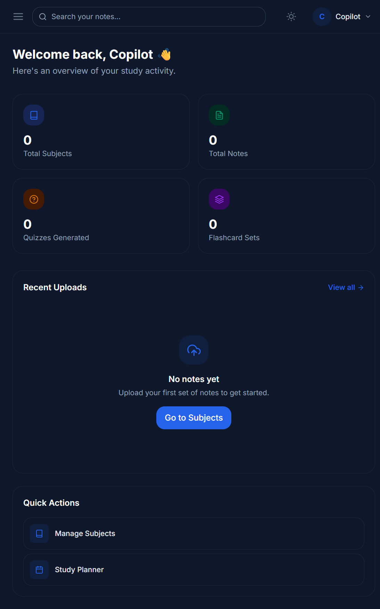
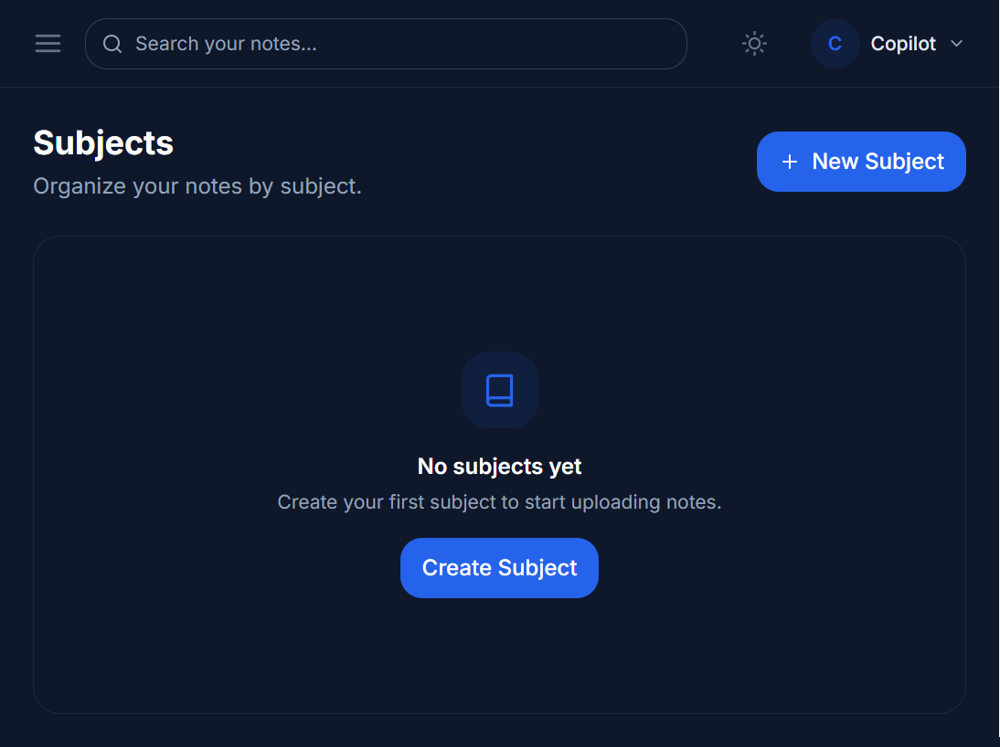
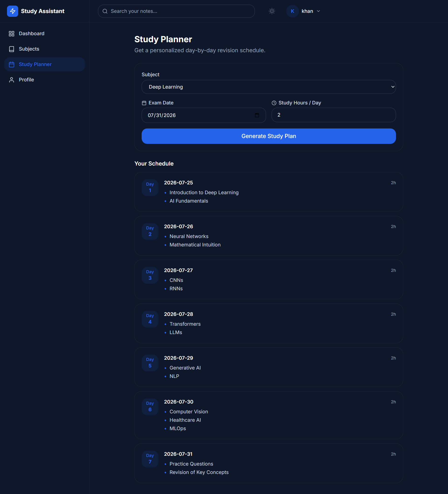

# AI Study Assistant

AI Study Assistant is a full-stack study companion for students who spend too much time rereading lecture notes and not enough time understanding them. It turns uploaded PDFs, DOCX files, and TXT notes into summaries, grounded Q&A, quizzes, flashcards, mock papers, and personalized study plans so learners can focus on revision instead of manual note digestion.


## What It Does

The app solves a simple but expensive problem: students often have a large volume of lecture notes but very little time to transform them into exam-ready material. AI Study Assistant automates that transformation for individual learners by organizing notes by subject, extracting the important ideas, generating practice material, and keeping every AI output tied to the student’s own content.

## Features

- Authentication with register, login, logout, and protected routes
- Student dashboard with totals, recent uploads, and quick actions
- Subject management for grouping related notes
- Secure note uploads for PDF, DOCX, and TXT files
- Automatic text extraction and stored note metadata
- AI summaries with key points, definitions, formulas, and exam tips
- Ask AI chat that answers only from the uploaded note
- Quiz generation with 5, 10, or 15 multiple-choice questions
- Flashcard generation with flip-card style revision
- Explain-Simply mode for rewriting complex text in plain language
- Study planner that creates a day-by-day revision schedule
- Mock paper generator with short-answer and long-answer questions
- Search across uploaded notes
- History tracking for every AI action and generated artifact
- Light and dark theme support

## AI Feature And Prompting

The AI layer uses Groq chat completions with JSON-only responses. Each workflow has a strict system prompt so the backend can parse the output safely and keep the UI predictable.

- Summary generation uses an expert academic assistant prompt that asks for a concise summary, key points, definitions, formulas, and exam tips.
- Ask AI uses a strict grounded-assistant prompt that allows answers only from the uploaded note text. If the model cannot find support in the note, the backend forces the exact fallback response: “This topic is not covered in the uploaded notes.”
- Quiz generation uses an exam-writer prompt that asks for the exact number of MCQs requested, with four options, one correct answer, and a short explanation for each item.
- Flashcards use a study-coach prompt that produces concise question-answer cards for spaced-repetition style revision.
- Explain Simply uses a friendly-teacher prompt that rewrites the input for a 12-year-old reader using simple words and a helpful analogy.
- Study Planner uses an academic-planner prompt that sequences foundational topics earlier and revision or practice closer to the exam date.
- Mock Paper uses an exam-paper-setter prompt that generates short-answer and long-answer questions strictly from the uploaded note.

Important implementation detail: note text sent to the model is capped to about 12,000 characters so the app stays within context limits on large documents.

## Tools, Services, And Models

- Frontend: React 18, Vite, React Router, Axios, Tailwind CSS, React Icons, react-hot-toast
- Backend: FastAPI, Pydantic v2, SQLAlchemy 2.0, SQLite, Uvicorn
- File parsing: PyMuPDF and python-docx
- Authentication: JWT with python-jose and bcrypt via passlib
- AI provider: Groq API
- AI model: `llama-3.3-70b-versatile`
- Deployment: Vercel for the frontend and Railway for the backend API

## Screenshots

### Dashboard



### Subjects



### Study Planner



## How To Run Locally

### Prerequisites

- Python 3.11 or newer
- Node.js 18 or newer
- A Groq API key

### Backend

```bash
cd backend
python -m venv venv
venv\Scripts\activate
pip install -r requirements.txt

copy .env.example .env
uvicorn app.main:app --reload --port 8000
```

Set `SECRET_KEY` and `GROQ_API_KEY` in `backend/.env` before starting the server.

### Frontend

```bash
cd frontend
npm install

copy .env.example .env
npm run dev
```

Set `VITE_API_URL` to your local backend URL while developing, for example `http://localhost:8000`.


## Repository Structure

```text
ai-study-assistant/
├── backend/
│   ├── app/
│   │   ├── core/
│   │   ├── models/
│   │   ├── routers/
│   │   ├── schemas/
│   │   └── services/
│   ├── uploads/
│   ├── Dockerfile
│   ├── requirements.txt
│   └── README.md
└── frontend/
    ├── src/
    │   ├── components/
    │   ├── context/
    │   ├── layouts/
    │   ├── pages/
    │   └── services/
    ├── public/
    ├── vercel.json
    └── vite.config.js
```

## Security Notes

- Passwords are hashed with bcrypt before storage.
- Non-auth routes require a JWT bearer token.
- Uploads are restricted to PDF, DOCX, and TXT files.
- Sensitive values such as `SECRET_KEY` and `GROQ_API_KEY` stay in environment variables.
- CORS is restricted to approved frontend origins.

## Future Improvements

- Streaming AI responses in the chat flow
- Spaced-repetition scheduling for flashcards
- Export quizzes and mock papers to PDF
- OCR for scanned or handwritten notes
- Multi-note context across an entire subject
- Usage analytics per subject

## License

This project was built as a university submission. All rights reserved by the author.
